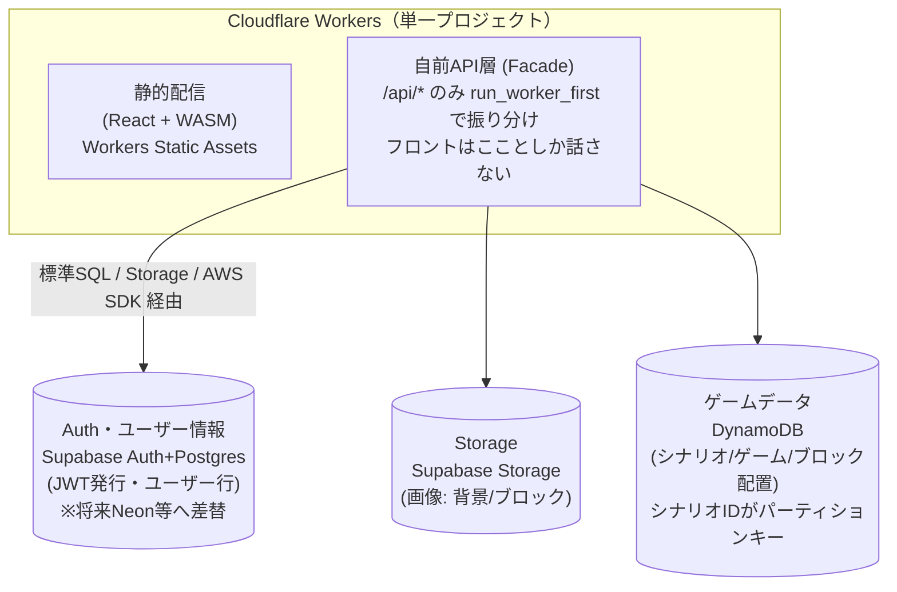

# ブロック崩し Web 公開 & UGC 基盤 設計書 — 全体概要

## この文書について

本ドキュメントは、Web 公開・UGC（User Generated Content）基盤に関する設計書群のうち
「全体像」を扱う。個別領域の設計は以下を参照。

- [機能要件](./requirements.md)
- [フロントエンド設計](./frontend.md)
- [バックエンド設計](./backend.md)
- [ローカル開発環境（デプロイ）](./deploy.md)
- [ホスティング・CI/CD](./hosting-and-cicd.md)

## 1. 目的とスコープ

現在の `bevy_sample` は、Bevy 製ブロック崩し（`game_engine`）を WASM ビルドし、
React フロント（`frontend`）から起動する **単一レベル・クライアント完結**のサンプルである。
これを次の 2 段階で拡張する。

1. **Web 公開**: 静的サイトとして誰でもアクセスできる状態にする（ホスティング／CI/CD／配信最適化）。
2. **UGC（User Generated Content）基盤**: 誰でも「画像＋パラメータ」を用意すれば自分のブロック崩し
   レベルを作成・公開でき、他の人はそれを一覧から選んでプレイできるようにする。

本書群はこの 2 段階を見据えたフル設計であり、以下を確定事項として前提に置く。

| 項目 | 決定事項 |
|---|---|
| フロントホスティング | Cloudflare Workers（Workers Static Assets） |
| 自前 API 層（Facade）のホスティング | フロントと同一の Cloudflare Workers プロジェクトに同居（Workers Static Assets の `run_worker_first` で `/api/*` のみ Worker 側に振り分け。[backend.md](./backend.md) §3） |
| バックエンド（Auth・ユーザー情報） | Supabase（Postgres + Auth。[backend.md](./backend.md) §1） |
| ゲームデータの保存（シナリオ／ゲーム／ブロック配置） | **DynamoDB**。シナリオ ID をキーとした KVS として保持する（[backend.md](./backend.md) §2） |
| 画像ストレージ | Supabase Storage（変更なし。ゲームデータ側からは URL 参照のみ持つ） |
| ローカル開発 | Docker Compose で完結させる。バックエンドはローカルではモック／ローカル互換スタックで代替する（[deploy.md](./deploy.md)） |
| **ポータビリティ方針** | **将来 Supabase から Neon 等の別 Postgres サービスへ移行する可能性があるため、特定ベンダー固有の仕組み（PostgREST 直叩き・RLS の `auth.uid()` 連携等）にフロントを直接結合させない（詳細 [backend.md](./backend.md) §3）。ゲームデータ側（DynamoDB）も同様に Facade の内部実装に留め、フロントは自前 API の契約しか知らない** |

未決事項（本書のレビューで確定させたい点）は末尾 §4 にまとめる。要件そのものに関する
未決事項（投稿認証の要否・上限サイズ・モデレーション等）は [requirements.md](./requirements.md) を参照。

---

## 2. 現状のアーキテクチャ（As-Is）

```
[ブラウザ]
  └─ React (frontend/) ── window.__BREAKOUT_CONFIG__ に初期化パラメータをセット
       ├─ backgroundBytes / backgroundMime   … 背景画像バイト列
       ├─ bricks: [{x,y}, ...] / cellSize    … ブロック配置
       └─ brickImage: { bytes, mime }        … ブロック用画像
       │
       └─ WASM (breakout.js / breakout_bg.wasm) を起動
            └─ game_engine (Bevy) が起動時（injection.rs）に上記を読み取り、
               無ければコンパイル時定数（config.rs）にフォールバックして描画
```

重要なのは、**現状の `injection.rs` がすでに「1レベル分のデータ構造」を定義している**点である。
これは以下のように UGC のレベルスキーマにほぼそのまま転用できる（詳細は [backend.md](./backend.md) のデータモデル参照）。

- 背景画像バイト列＋MIME
- ブロック配置（座標配列 + セルサイズ）
- ブロック用画像バイト列＋MIME

一方、パドルサイズ・ボール速度・初期ライフ数などは `config.rs` の Rust 定数にハードコードされており、
現時点では JS から注入不可能。UGC の MVP では「背景・ブロック配置・ブロック画像」のみを
可変パラメータとして扱い、ゲームバランス系パラメータの外部化は将来拡張とする（[requirements.md](./requirements.md)）。

現状の課題（Web 公開前提で見たときの不足）：

- CI/CD なし、デプロイ設定なし
- ルート README なし
- 背景画像は「S3 等 CORS 許可済みホスト」から React が fetch する設計だが、本番ドメイン・CORS 設定は未確定
- バックエンド／永続化層が存在しない（＝レベルを保存・共有する仕組みがない）

---

## 3. 拡張後の全体アーキテクチャ（To-Be）



フロントと自前 API 層は同一の Cloudflare Worker 内に同居する（別オリジンではないため CORS 対応は
不要）。ブラウザからのリクエストは `/api/*` かどうかで Worker 内部で振り分けられ、フロントは
「自前 API の契約（`/api/levels` 等）」としか話さない、という制約自体は変わらない。

処理の流れ（UGC MVP）:

1. **作成**: ユーザーがレベルエディタ（フロント側の新機能）で背景画像・ブロック配置・ブロック画像を
   用意 → 自前 API 層に送信 → API 層が画像を Storage に保存し、パラメータ（座標配列・cellSize・
   画像参照 URL・メタ情報）を DynamoDB に保存する（詳細は [frontend.md](./frontend.md) / [backend.md](./backend.md)）。
2. **一覧**: レベル一覧画面が自前 API 層（`GET /api/levels`）から公開レベルのメタ情報
   （タイトル・サムネイル URL・作者等）を取得して表示。
3. **プレイ**: 選択されたレベルの ID を自前 API 層に渡し、DynamoDB・Storage を引いた結果を
   `window.__BREAKOUT_CONFIG__` に整形して詰める → 既存の `injection.rs` がそのまま読み込む
   （**game_engine 側の変更は不要**、フロントの「どこからパラメータを取得するか」だけが変わる）。

この設計の利点は 2 つある。

- **Bevy/WASM 側を一切改修せずに UGC 基盤を追加できる**こと。既存の
  `window.__BREAKOUT_CONFIG__` 契約を「フロントが静的に組み立てる」から「フロントがバックエンドから
  取得して組み立てる」に差し替えるだけで済む。
- **フロントが Supabase 固有の仕組み（PostgREST の URL 規約・RLS の `auth.uid()`・
  Storage SDK）を一切知らない**こと。フロントが知っているのは自前 API 層の契約
  （`GET /api/levels` 等）だけであり、Supabase から Neon 等へ移行する際の影響範囲は
  API 層の内部実装に閉じる（詳細は [backend.md](./backend.md) §3）。

---

## 4. 段階的ロードマップ

| フェーズ | 内容 |
|---|---|
| 0（現状） | 単一レベル・クライアント完結の静的サイト |
| 1 | Web 公開のみ（Cloudflare Workers + CI/CD、バックエンドなし） |
| 2 | UGC 基盤 MVP（Supabase: Auth + Storage + Postgres、レベル投稿・一覧・プレイ） |
| 3 | スケール対応（必要になれば読み取りキャッシュ／KVS の追加を検討） |
| 4 | いいね・検索・タグ・モデレーション等の拡張機能 |

---

## 5. 未決事項・要確認（アーキテクチャ側）

要件そのものに関する未決事項（投稿認証の要否・上限サイズ・モデレーション等）は
[requirements.md](./requirements.md) にまとめた。以下は実現方式（アーキテクチャ）側の未決事項。

- [ ] Supabase を Supabase 社のクラウド版で使うか、自前セルフホストするか（コスト・運用負荷が変わる）
- [ ] Cloudflare Workers から Postgres（Supabase／将来の Neon）への接続方式
      （TCP 直結か、各社提供の HTTP 経由ドライバか）は実装着手時に個別検証が必要（[backend.md](./backend.md) §4）
- [ ] 認証プロバイダも将来差し替える可能性を見込むか（見込む場合、Supabase Auth の JWT を
      API 層で標準的に検証するだけに留め、Supabase Auth 管理系 API への依存は避ける）。
      → [backend.md](./backend.md) §5 で「Auth.js を自前 API 層に内包し Supabase は素の Postgres としてのみ使う」案を
      検討中（技術調査: `docs_bevy_sample/20260730_authjs-oauth-on-cloudflare-pages-functions.md`）。
      結論は「技術的に実現可能だが上級者向け構成、PoC 未実施」。採用可否は PoC 後に確定させる
- [ ] **用語の整理**: [requirements.md](./requirements.md) / [frontend.md](./frontend.md) は
      まだ「レベル」（1 画像セット＋ブロック配置の単体）という単位で書かれているが、
      [backend.md](./backend.md) §5.1 のデータモデルは「ゲームシナリオ（複数ゲームの順序付き集合、
      URL でアクセスされる単位）」「ゲーム（旧レベル相当、シナリオに属する）」という 2 階層に
      拡張済み。API 契約（`/api/levels` 等）・画面名・要件記述の「レベル」を「シナリオ／ゲーム」
      に置き換えるかどうかは未反映。用語を揃えるタイミングで各ドキュメントに反映すること
