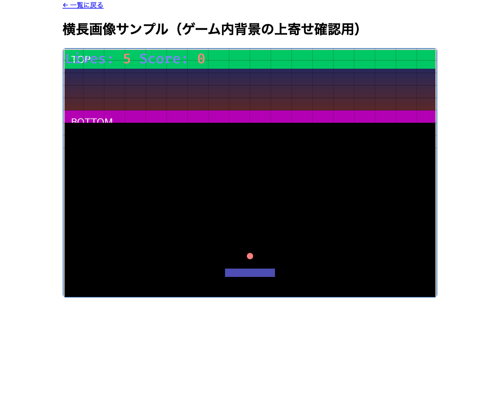

# 画像の「上寄せ」対応（サムネイルのクロップ位置 と ゲーム内 contain 配置）

日付: 2026-08-03

縦長・横長の画像をうまく扱えていなかった 2 箇所（フロントのサムネイル／ゲーム内背景）に
それぞれ別の理由で「上寄せ」対応を入れた記録。**この 2 つは見た目の症状は似ているが、
原因も直し方も別物**なので混同しないこと。[[20260715_aspect-ratio-and-letterbox]] の
`contain_fit` を前提にする。

## 1. フロント: `LevelCard` サムネイルのクロップ位置

`frontend/src/entities/level/ui/LevelCard.css` の `.level-card-thumbnail` は
`object-fit: cover`（画像をクロップして箱を埋め尽くす方式）を使っている。縦長寄りの画像
（`Ameca_robot.jpg`, 962×1080）だと、デフォルトの中央クロップで被写体（頭部）が上に見切れた。

**対応**: `object-position: top` を追加。縦長画像は上側（顔など重要な情報が来やすい部分）を
残してクロップするようにした。

```css
.level-card-thumbnail {
  width: 100%;
  aspect-ratio: 16 / 10;
  object-fit: cover;
  object-position: top; /* 縦長画像は上側を残してクロップする */
  display: block;
}
```

この効果を分かりやすく確認するため、`tall_portrait_sample.png`（500×1500、1:3の極端な縦長。
上端に黄色地+赤丸+"TOP"、下端に青地+"BOTTOM"のマーカー）を作り、`mockLevels.ts` に
恒久サンプル `tall-portrait-sample` として追加した。レベル一覧では `TOP` マーカーが残り
`BOTTOM` は見切れることを確認済み。

## 2. ゲーム内: `contain_fit` の配置基準

### 2.1 「縦長画像でテスト」では効果が確認できなかった

上記のサムネイル修正の直後、ゲーム内の背景・ブロック画像描画（`contain_fit`。**クロップせず
画像全体を縮小して収める**方式）にも同様に上寄せが必要か検証した。結論: **縦長画像では
意味が無い**。

`contain_fit` はアリーナ（900×600、1.5:1）に対して縦横どちらか小さい方の倍率を採用する。
縦長画像（アスペクト比がアリーナより小さい）は常に「高さ基準」で内接するため、画像は
アリーナの上端から下端までぴったり埋まり、余白は左右にしか出ない。つまり縦方向の余白が
そもそも無いので、上寄せと中央寄せで結果が変わらない（`tall_portrait_sample.png` や
`Ameca_robot.jpg` で実際に確認しても差が出なかった）。

上下に余白ができるのは、**アリーナよりアスペクト比が大きい横長画像**のときだけ（「幅基準」で
内接し、余った高さが上下の余白になる）。

### 2.2 実装: `inscribed_source_rect` を「水平中央・垂直上寄せ」に変更

背景 Sprite・ブロック画像のテクスチャ切り出し（`common::brick::texture_crop`）・画像差分
判定（`injection::diff_brick_layout`）は全て `util::inscribed_source_rect` の同じ写像を
共有しているため（[[20260802_brick-diff-auto-layout]] 参照）、ここを直せば 3 箇所すべてに
一貫して反映される。

```rust
// util.rs（要点）
pub fn inscribed_source_rect(
    region_center: Vec2,
    region_size: Vec2,
    container: Vec2,
    image_size: Vec2,
) -> Option<Rect> {
    let display = contain_fit(image_size, container);
    let half_x = display.x / 2.0;           // 水平は中央寄せのまま
    let top_y = container.y / 2.0;          // 垂直はコンテナ上端に画像の上端を揃える
    let bottom_y = top_y - display.y;
    // ...（範囲外判定・UV算出は top_y/bottom_y 基準に変更）
}
```

背景 Sprite 側（`systems/setup.rs`）も同じ規約に合わせる。`Anchor::TOP_CENTER` にし、
`Transform` の Y を `TOP_WALL`（アリーナ天井）にする。

```rust
commands.spawn((
    Sprite { image: background_handle.clone(), custom_size: Some(background_size), ..default() },
    Anchor::TOP_CENTER,
    Transform::from_xyz(0.0, TOP_WALL, -10.0),
));
```

`bevy_sprite::Anchor` は Bevy 0.19 では `Sprite` のフィールドではなく**別コンポーネント**
（`pub struct Anchor(pub Vec2)`、定数は `Anchor::TOP_CENTER` のように `SCREAMING_SNAKE_CASE`）
である点に注意（`Sprite { anchor: ... }` は存在せず `E0560` になる）。

**なぜ上寄せにする意味があるか**: 画像差分の自動ブロック配置
（[[20260802_brick-diff-auto-layout]]）はアリーナ上部（天井付近）だけを対象にする設計。
横長のデザイン画像を使う場合、画像の内容がアリーナ天井に揃っていた方が、ブロックが実際に
生成される範囲との整合が取れる。

### 2.3 動作確認: `contain` は縮小するだけでクロップしない

`wide_landscape_sample.png`（1800×400、4.5:1 の極端な横長。上端に緑帯+"TOP"、
下端に紫帯+"BOTTOM"）を作り、`mockLevels.ts` に恒久サンプル
`wide-landscape-top-align-sample` として追加して確認した。



**確認できたこと（＝当初の予想とは違った点）**: `contain` は画像を一切クロップしない
（`object-fit: cover` と違い、常に画像全体を縮小して収める）。そのため上寄せにしても
`TOP` マーカーも `BOTTOM` マーカーも**両方とも見える**。実際に起きるのは「画像全体が
アリーナ天井まで押し上げられ、余白（レターボックス）が下側だけにまとまる」こと（中央寄せ
なら上下に半分ずつ余白が出ていたはず）。1 節の `object-fit: cover`（クロップ方式）と
アルゴリズムの性質が根本的に違うので、「上端/下端どちらかが見切れるはず」という予想は
`contain` には当てはまらない。この勘違いに気づかず先に予想をコメントへ書いてしまい、
実際にスクリーンショットを撮ってから間違いに気付いて訂正した。

なお `bricks: []` のみだとデフォルトの単色ブロックがアリーナ上部を覆って背景の上端が
隠れてしまう（`tall-portrait-sample` の検証で先に判明していた問題）ため、この確認用
レベルでは `brickImage` にも同じ画像を指定し、ブロック越しでも同じ絵がシームレスに
見えるようにしている。

## 3. まとめ表

| 場所 | 表示方式 | クロップの有無 | 上寄せが要る条件 |
|---|---|---|---|
| `LevelCard` サムネイル（フロント） | `object-fit: cover` | する（はみ出た部分を切り捨て） | 縦長画像（箱よりアスペクト比が小さい） |
| ゲーム内背景/ブロック画像 | `contain_fit`（Rust） | しない（全体を縮小） | 横長画像（アリーナよりアスペクト比が大きい） |

対応が必要な画像の向きが**逆**である点が紛らわしいので注意。

## 4. 関連ファイル

- `frontend/src/entities/level/ui/LevelCard.css` — `object-position: top`
- `frontend/src/entities/level/api/mockLevels.ts` — `tall-portrait-sample` /
  `wide-landscape-top-align-sample`
- `game_engine/assets/backgrounds/tall_portrait_sample.png` /
  `wide_landscape_sample.png` — 検証用画像
- `game_engine/src/util.rs` — `inscribed_source_rect`（上寄せ化）
- `game_engine/src/systems/setup.rs` — 背景 Sprite の `Anchor::TOP_CENTER` 化

## 5. 関連ドキュメント

- [[20260715_aspect-ratio-and-letterbox]] — `contain_fit` そのものの導入経緯（中央寄せ時代の記録。4節に本件の更新を追記済み）
- [[20260802_brick-diff-auto-layout]] — `inscribed_source_rect` を共有する画像差分自動配置
